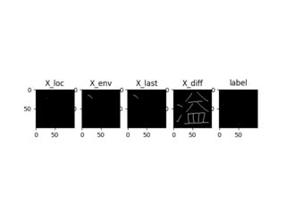
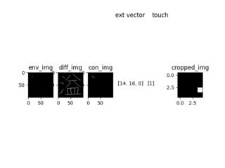

# KANJIVG DATASET

Dataset for training models in teaching robots to draw.

## Important Points !

1. characters are now used are from kanjivg collection of japanese characters

2. original characters are defined using bezeir curves, this repository modifies the characters svg files by converting bezeri curves into line segments which are easier to handle (ex : Mc to ML)

3. few characters are removed because of in-compaitability reasons, will be restored in future commits

## Visualization of datasets

Global Dataset

Local Dataset

### scripts and their functions

1.**bresenhamsalgo.py** --> this module has implementation for segmenting a given straight line into point with interval in range of +-2

2.**drawing_utils.py** --> module with most used functions for drawing strokes

3.**extract_kanjivg.py** --> converts characters defined in bezeir curves into characters with simple line segments Mc to ML

4.**local_strokegenerator.py** --> python generator, which yields data samples required for training local model

5.**kanjivg_modified.tar.gz** --> compressed file with kanjivg modified characters (bezeir to line segment converted)

6.**derprecated/** --> folder with python scripts which create pickled datasets (generates large datasets as much as 55GB or more depending on sample size, using python generator is much lighter and faster because of less I/O during training)

7.**dry_run_check.py** --> check working of python generator which yeilds samples during training and remove invalid flies ex: with negative cordinates.

### CREDIT

All characters in this repository are from [kanjivg webpage](http://kanjivg.tagaini.net/index.html) and are used under Creative Commons Attribution-Share Alike 3.0 license.
